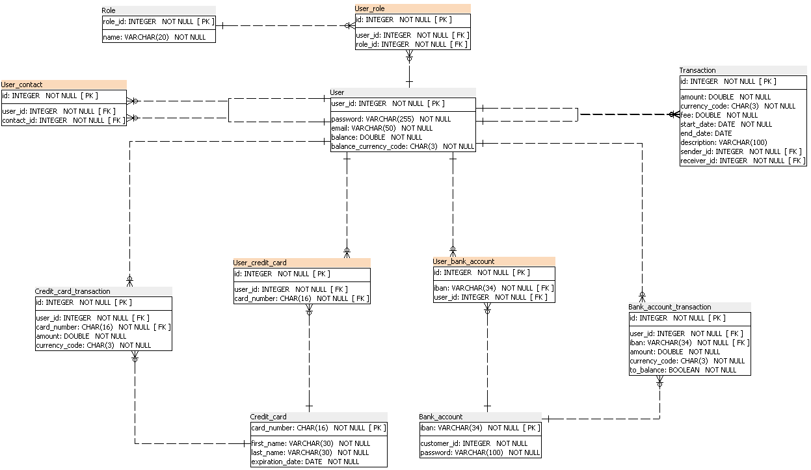
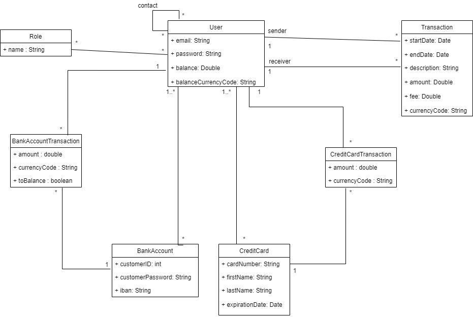

# P6_PayMyBuddy
Pay My Buddy is a money transfer app allowing its users to send money to each other fast and easily.

# Physical schema


# Class diagram


## Getting started
How to run the project ?

### Prerequisites
- Java 16
- Maven 3.8.1
- Mysql 8.0.17

### Installing
1. Install Java https://adoptopenjdk.net/
2. Install Maven https://maven.apache.org/install.html
3. Install MySql https://dev.mysql.com/downloads/mysql/

After downloading the mysql 8 installer and installing it, you will be asked to configure the password for the default root account. This code uses the default root account to connect and the password can be set as rootroot. If you add another user/credentials make sure to change the same in the code base.

### Running App
Post installation of MySQL, Java and Maven, you will have to set up the tables and data in the data base. For this, please run the sql commands present in the P6_01_schema.sql and P6_02_data.sql (in this order) files at the root of the project.

Finally, you will be ready to import the code into an IDE of your choice and run the MoneyTransferApplication.java to launch the application.

### Testing
To run the unit tests, please execute the below command
```Java
mvn test
```
To run both the unit tests and the integration tests, please execute the below command 
```Java
mvn verify
```
